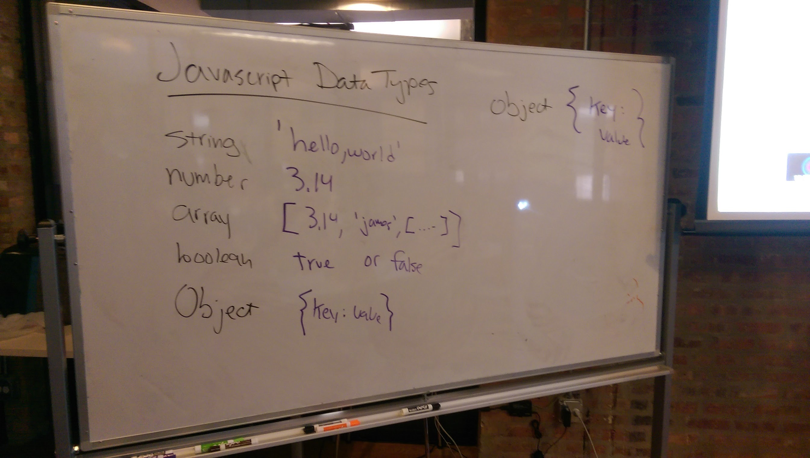
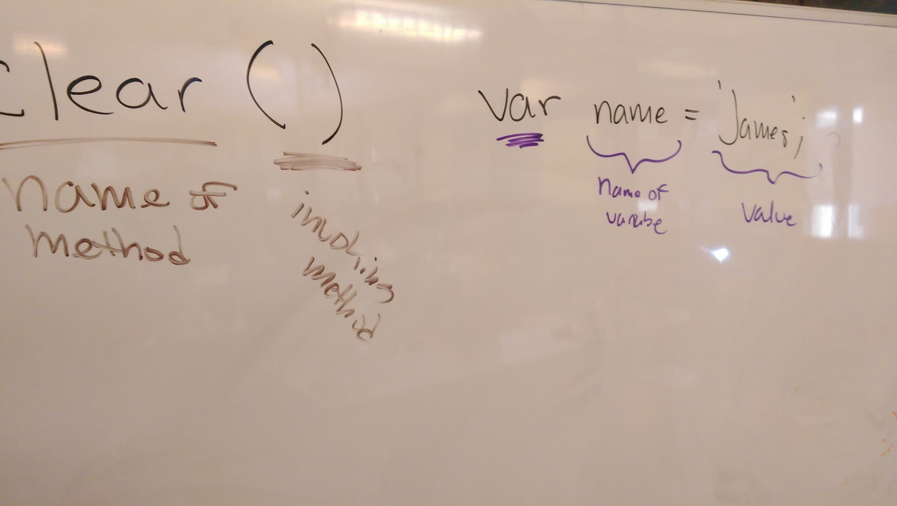
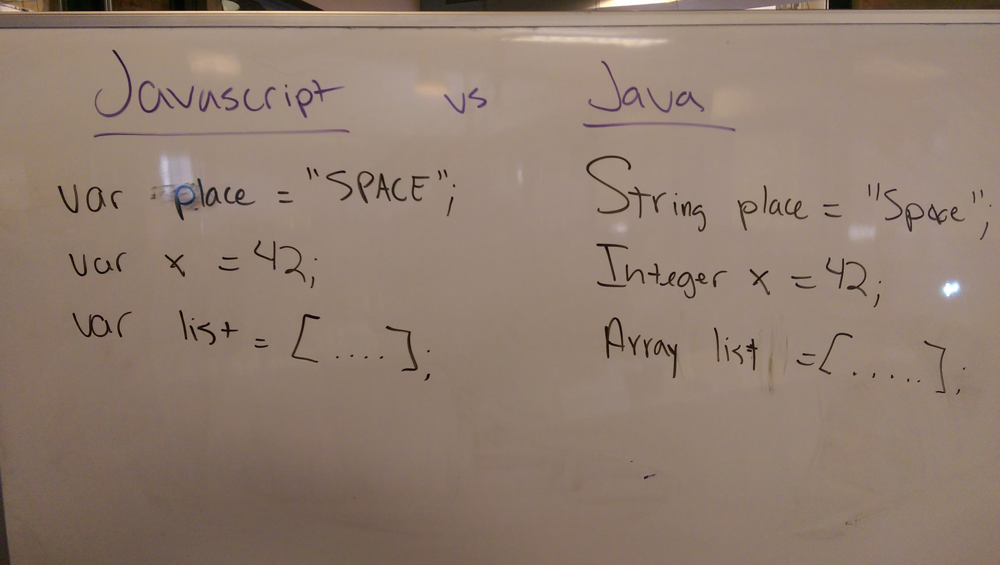
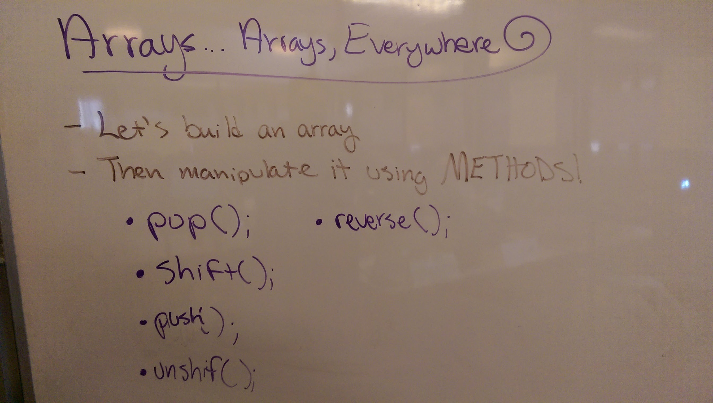

## 1.2 Hello, World

#### Data Types, Variables, and Arrays

##### Objectives

- Describe the concept of a "data type" and how it relates to variables
- Describe use cases of different "data types"
- Declare, assign to, and manipulate data stored in a variable
- Explore and use a programming or markup language's standard library and built-in functions (iterators, datatype/array methods)
- Iterate over and and manipulate values in an array
- Describe how arrays are used to store data

###### Class Examples









```javascript
var cocktails = ['gin & tonic', 'white russian', 'mojito', 'sangria', 'grape ape'];

cocktails.pop();  // pop() removes the last item in an array

// this didn't work...
//var lengthOfArray = cocktails.length;

// this will!
for (var i = 0; i <= cocktails.length; i++) {

  console.log('i = ' + i);
  //console.log('array length = ' + lengthOfArray);''
  console.log(cocktails[i]);

  console.log("I could use a... " + cocktails[i]);

  cocktails.pop();
}
```

#### Mastering Control Flow

##### Objectives

- Differentiate between true, false, 'truth-y', and 'false-y'
- Use if/else if/else conditionals to control program flow based on boolean conditions
- Use switch conditionals to control program flow based on explicit conditions
- Use comparison operators to evaluate and compare statements
- Use boolean logic (!, &&, ||) to combine and manipulate conditionals

##### Class Examples

```javascript
// block of code
{
  console.log('hello, world');
}

var age = confirm('Are you over 21?');
if (age === true) {
  alert('huzzah');
} else {
  alert('soon.jpg');
}

// 'location' is a reserved word
var somewhere = window.location.host;
if (somewhere != 'ga-chicago.github.io') {
  alert('oh no! this is not the right website.');
} else {
  alert('awww yeaah u aint hackd');
}

var userInput = prompt('what is your name?');

if (userInput.length < 1) {
  alert('hey, you didn\'t give us your name');
} else {
  alert('thanks, ' + userInput + '!!!!!@121211212');
}

// and operator &&

if (age >= 21 && hasMoney == true) {
  // you can buy booze
}

if (21 >= 21 && true == true) {
  console.log('you can haz booze');
}


// OR operator ||

if (true || false) {
  console.log('boolean party!!@!212');
}

var name = 'james';
if (name === 'james' || name === 'jim') {
  console.log('j names rule');
}


var car = 'ford';
switch (car.toLocaleLowerCase()) {
  case "mazda": alert('mazdas zoom zoom');
    break;
  case "nissan": alert('the leaf is green');
    break;
  default:
    alert('your car is not here..?!@');
    break;
}
```

#### Lab: Introduction to Git & Github

- 
- Slide Deck: https://presentations.generalassemb.ly/559430358d25e96187c4#/
